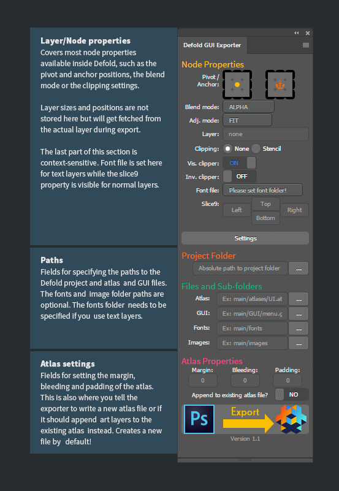
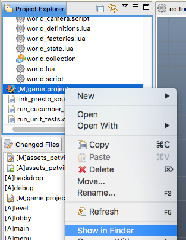
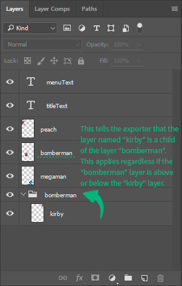
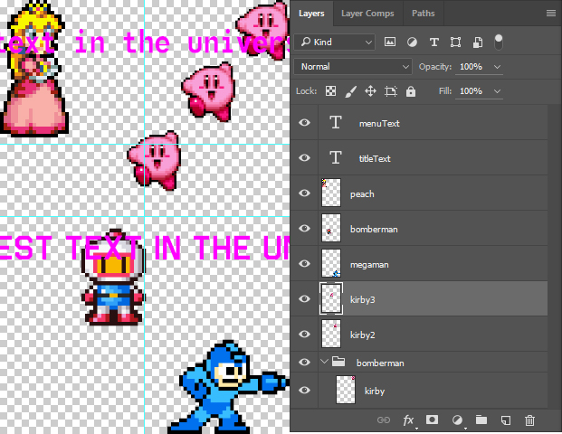
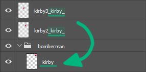

# Defold Photoshop GUI Exporter

This page contains information about the Photoshop GUI Exporter extension panel – what it does, how it works, and how you can use it to speed up the process of bringing a GUI design+layout from Photoshop into Defold.

---

## About

This extension makes it easier to take a GUI design and layout from Photoshop and turn it into a GUI scene (.gui) in Defold.

Information from each layer – such as name, size or position – will be exported to file format that Defold understands, and will be represented as nodes in the GUI scene graph. Additional data such as pivot positions or slice9 properties are stored as per-layer metadata **which means that every layer will have it's own unique properties** – just like Defold nodes does. These properties are then displayed on and managed by the extension panel inside Photoshop.

*(Overview of the GUI exporter panel)*

---

## Lingo

**Art Layer** – A "normal" layer with raster graphics OR a text layer.

**Bleeding** – How much the border pixels of a layer should "grow" outwards.

**Layer Set** – Also known as a "Group" or "Layer Group".

**Margin** – Extra space on the outside of a layer.

**Node** – Box or Text node inside Defold. In Photoshop these are represented as Art Layers.

**Panel** – Photoshop UI object that holds a set of controls, actions, layers or other items.

**Padding** – Extra space on the inside of a layer.

**UI control** – Interactive object of a user-interface.

**ZXP** – Installation file for Adobe extensions.

---

## Installation

**Panel is supported in Adobe Photoshop CC and later only.**

1. Make sure that you have an extension installer on your computer [1].

2. Download the attachment from download link at the top of this page.

3. If Photoshop is open; save your work and close down Photoshop.

4. Use your extension installer to install the ZXP file.

5. Start up Photoshop. You will find the exporter under **Window > Extensions > Defold GUI Exporter**

[1] Several options here. First step is to uninstall the appalling Adobe Extension Manager which is actually no longer supported/maintained by Adobe.

Next step is to download a custom one: Anastasiy's Extension Manager – [http://install.anastasiy.com/](http://install.anastasiy.com/)

If you have troubles with Anastasiy's you can try this: ZXPInstaller – [http://zxpinstaller.com/](http://zxpinstaller.com/)

---

## Getting started

The exporter comes with one example workfile with iPhone 4S resolution. You can open it up and test the exporter on it right away if you want to, but probably you want to start from scratch.

It is important that you use a workfile that has the same display resolution as your Defold project (game.project file) in order to avoid unwanted results.

Now create/import your GUI art and lay it out on the canvas. Use the extension panel to look over the layer (node) attributes.

Before exporting, be sure to click on "**Settings**" and set the paths to the project folder, the gui file and the atlas file. Info on this below.

**Project Folder**

This path must point to where the Defold project is located on the hard drive and it must be an absolute path.

Usually this folder is located in the Defold installation under something like

**Windows**

*C:/Program Files (x86)/Defold/branches/30441/4614/local01/*

**Mac**

*/Applications/Defold/branches/9285/1249/master*

( *9285/1249/master =* The first number is your project, the second number is your user and the name is the name of the branch. )

A trick you can do is to open up your Defold project and then right-click the *game.project* file the Project Explorer and choose *Show in Explorer* (Win) or *Show in Finder* (OSX). A window will open up in the Explorer/Finder and from there just copy the path that goes to the /main/ folder.

**Files and Sub-folders**

You MUST specify an atlas file and a GUI file or the exporter will halt execution and notify the user! Additionally, required path fields will be lit in red to avoid any confusion. The paths can be either absolute or relative but for convenience, relative paths are preferred, like this:

main/atlases/assets.atlas

main/atlases/test.gui

main/fonts/

main/images/

...however, the exporter is designed to handle user mistakes (missing file extension, etc)

Also please note that the exporter will generate new files on disk by default, but you can choose to tell the exporter that you do not want to overwrite the old atlas file by making sure the last switch (Append to existing atlas file?) is set to **YES**.

Because of the ways that Photoshop and Defold differs in their representation of layers/nodes, there are certain things you need to setup within your workfile when it comes to certain things. Nothing to worry about really, just keep in mind that some special rules applies if you want to setup parented nodes or have make several nodes/layers use the same resource on the atlas. These "rules" are described below under **"Parenting"** and **"Shared resource"**.

---

## Parenting and Shared resources

Special rules applies if you want to setup a layer to be a parent of another, or if you want to setup multiple layers to use the same image resource on your atlas.

### **Parenting**

In Defold you can setup parent-child -relationship between nodes by dragging and dropping one onto another.

Photoshop on the other hand has no way of parenting layers to each other: you only have layer linking and layer sets (group).

In order to tell the GUI exporter about our parent-child relationships we will use Layer sets (groups) and rename these to the same name as the parent layer. To the right is an example of how to setup your workfile so that the exporter takes these relationships into account. Here we are telling the exporter that the layer kirby is parented under the layer bomberman. Now this applies regardless of where the bomberman -layer set is located, so in order to avoid confusion: Always place the layer set below the actual layer it is referring to.

*How to make the exporter understand parenting*

### **Layer groups**

Important to know here is that you can still use layer groups like normal. Basically there are two "modes":

1) Like you've always used them before – using a name that is not the same as another layer

2) For parenting – using a name that is the same as another layer

**Note**

Be careful with the names. If the exporter finds a layer set name that does not correspond with a layer name, that layer set will be merged and exported as an individual node.

### **Shared resources**

By default the exporter will go through every art layer and process it to be an individual node, even if some or all of the layers have identical pixel information. So in order to not get outrageous atlases, we need to tell the exporter when we want an image resource to be assigned to multiple layers.

In the example to the right, we have three individual "kirby" -layers. Each one of these will be written as a unique entity in the atlas file, meaning we end up with duplicates: we will get three identical Kirby -characters. This is bad – we want atlases to be as small as possible!

*(Using several identical layers like this will result in duplicates on the atlas!)*

So in order for us to tell the exporter not to waste space on our atlas like this, we need to tag layers with a prefix. The syntax (grammar) for this is underscore layer name underscore: **_kirby_**

Or in other words:

If we have several clones of the layer "kirby", we append this suffix to their name: **_kirby_**

...so that we get: kirby2_kirby_ , kirby3_kirby_ , and so on (if we have more dupes). The picture below depicts a correct setup!

*(How to avoid duplicate image resources on an atlas)*

---

## Limitations

Because of the big differences between Defold nodes and Photoshop layers, there are some limitations that you need to be aware of.

### Pie nodes

There is no support for pie nodes in this exporter. Photoshop has no visual way of representing such an object and as such, pie nodes cannot be supported by the exporter.

### Font nodes

This one is probably obvious to all but it's worth mentioning this anyway: Photoshop has very vast and extensive font and text customization support while Defold is much more limited in this area. While some more extended font and text support is technically possible, things like font shadow and outlines are not covered by this exporter. Same thing goes for leading (row height) and tracking (character distance). So for now, all that is exported is the text layer position, font size and font name.

### Multiple atlas files

Support for multiple atlas files will not be included in this first version, but will be implemented in a future version.

### Smart objects / Multiple workfiles

There is no support for Smart objects.

Also keep in mind that this is an **EXPORTER**. Changes done to your GUI inside of Defold will not affect your work inside of Photoshop. In the future it is entirely possible that some two-way communication can be made, but for now treat this tool as a one-way-only exporter.

---

## Technical
This section contains technical details on the exporter and how it works – it is primarily written for Technical Artists and as such, no lingo descriptions will appear.

**One way only:** Remember that this is an exporter. Changes done inside of Defold after you've exported your GUI will not have an effect on your Photoshop workfile. Maybe in the future there will be possible to setup two-way communication but for now, this extension panel will be limited to exporting.

**Metadata:** This panel is at it's core a combination of a metadata reader/writer and exporter. Metadata is both saved per-document and per-layer. Things such as the Project Folder info or the properties of the Atlas are saved as document metadata.
All layer/node properties are saved for each individual layer. LOTS of cool stuff can be done with metadata in case you have plans for developing a panel. For example: making a tool that has layer-specific guides is entirely possible!!

**Event listener:** The metadata is retrieved and the panel UI controls are updated by a callback function that is executed by an event listener. The event listener will fire off every time there is a new layer selection. It is possible to have multiple event listeners listening in on several different events, but this a bit trickier to implement. If interested please see: https://forums.adobe.com/thread/1934925

**Exporting:** The exporting is done in three steps: **First** the metadata is read and compiled into a file string (JSON), **Then** the atlas, font and gui files are written to disk. **Last**, the tool will cycle through all layers one by one, duplicating the document and trim away alpha pixels around them before finally saving the image file (PNG) on disk.
